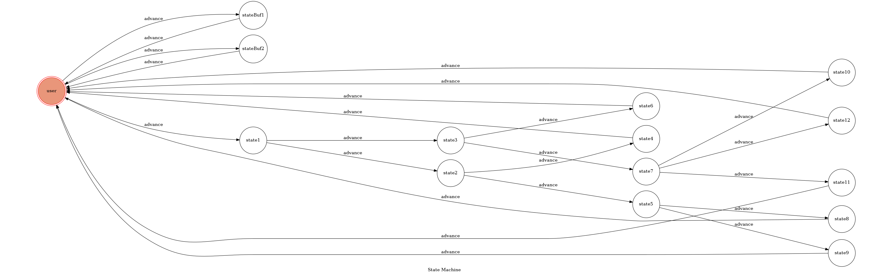

# TOC Project 2017

Template Code for TOC Project 2017

A telegram bot based on a finite state machine

## Finite State Machine

## Usage
This bot gives a small quiz to help user determine her/his lunch, and analyzes her/his personality.

The initial state is set to `user`.

Every time `user` state is triggered to `advance` to another state, it will go to other state after the bot replies corresponding message.

* **user**
	* Input: "吃午餐囉"
		* Reply: "你是個森林獵人，走在魔法森林裡，尋找美味的午餐，這時，樹叢裡發出奇怪的聲響，你遇到的是[獨角獸]還是[蜂鳥]呢？"
		* Next State: state1
	

	* Input: "吃早餐囉" or "吃晚餐囉"
		* Reply: "沒得吃[restart]"
		* Next State: stateBuf1
		
	* Input: "怎麼玩"
		* Reply: "[restart] 記得在restart後打入「吃午餐囉」，才可以順利地知道今天該吃什麼喔!"
		* Next State: stateBuf2
* **stateBuf1**
	* Input: "restart"
		* Reply: "restart"
		* Next State: user
* **stateBuf2**
	* Input: "restart"
		* Reply: "restart"
		* Next State: user

* **state1**
	* Input: "獨角獸"
		* Reply: "獨角獸是個非常迷人的生物，白色的毛皮，溫潤的角，身為獵人的你，會[把她當作午餐]還是[騎著她尋找食物]？"
		* Next State: state2
	

	* Input: "蜂鳥"
		* Reply: "蜂鳥看到你，唱起了一首歌，美麗的森林不再，青翠的綠樹消失，邪惡的力量在世界擴散，勇敢的獵人呀，你是否願意跟著我，拯救失衡的世界。心中很受觸動的你，會選擇[跟他走]還是[繼續尋找午餐]？"
		* Next State: state3

* **state2**
	* Input: "把她當作午餐"
		* Reply: "選擇把獨角獸吃掉的你，屬於A型人，堅決果斷，做事不猶豫，不易受到誘惑，敢把奇幻動物中的佼佼者獨角獸吃掉，代表你不迷信，有很大的可能，是個宅宅。建議你今天的午餐吃紅酒燉牛肉配西瓜汁，兩個分別吃起來都很美味，一起就不知道了。[restart]"
		* Next State: state4
	

	* Input: "騎著她尋找食物"
		* Reply: "騎在獨角獸的背上，你感受到一種輕盈的感覺，不知不覺就睡著了……等你清醒之後，發現自己來到一個美麗的水晶皇宮，這是[黑皇后]還是[精靈帕金森的家]呢？"
		* Next State: state5

* **state3**
	* Input: "跟他走"
		* Reply: "選擇成為超級英雄的你，是B型人，憨厚老實，但內心又存著熱血，像這種人，肯定是宅宅，建議你午餐去吃泡麵，回到現實社會吧。[restart]"
		* Next State: state6
	

	* Input: "繼續尋找午餐"
		* Reply: "走著走著，你來到湖邊，耳邊又傳來一陣悅耳的歌聲，她是[拿著金斧頭的河女神]還是[拿著你的彈弓的河男神]或是[美人魚]呢？"
		* Next State: state7

* **state5**
	* Input: "黑皇后"
		* Reply: "選擇黑皇后的你，最後跟黑皇后共進了美味的午餐，屬於C型人。溫柔體貼，風流成性是你的代名詞，每天跟不同妹子帥哥吃飯，並且是大家的精神支柱，建議你今天的午餐跟往常一樣，去找最正的女朋友一起吃大豆豆吧。[restart]"
		* Next State: state8
	

	* Input: "精靈帕金森的家"
		* Reply: "會選擇這麼不靠譜的精靈帕金森的你，是個浪漫可愛，總是活在自己幻想的少女，屬於D型人。像你這麼可愛，肯定是男孩紙，午餐就吃珍奶配豬排吧，或是你再忍一下，晚餐去吃鳳凰來～[restart]"
		* Next State: state9

* **state7**
	* Input: "拿著金斧頭的河女神"
		* Reply: "選擇金斧頭而不是自己的彈弓，你是一個會審視自己，努力向上的人，是傳說中的E型人。身為E型人的你，每天忙著工作、寫作業、打扣，才不會吃午餐呢。[restart] "
		* Next State: state10
	

	* Input: "拿著你的彈弓的河男神"
		* Reply: "選擇男神的你，忠實的面對自己的慾望，是所謂的F型人，你在別人的眼中，總是神祕、有才華，但實際上你是個很愛喵喵的人，每天都一定要吸貓。今天你的午餐就吃咖哩飯吧，香濃濃的味道，你的貓也好喜歡。[restart]"
		* Next State: state11
		
	* Input: "美人魚"
		* Reply: "美人魚真的很美，你與她過著幸福快樂的日子。在美人面前沒辦法的你，是G型人，你喜歡跟你的朋友聚在一起看正妹帥哥，只要是美的東西你都喜歡，既然這樣，午餐就找助教吃吧，每個助教都花容月貌的<3快去邀助教吃目白！[restart] "
		* Next State: state12
* **state4** or **state6** or **state8** or **state9** or **state10** or **state11** or **state12**
	* Input: "restart"
		* Reply: "restart"
		* Next State: user

